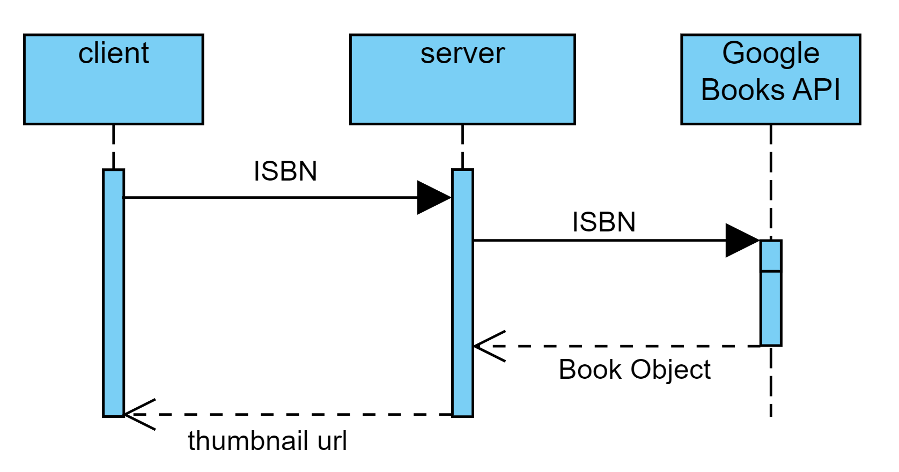

# Thumbnail-Microservice

Note: this microservice makes use of the Python Requests library

see documentation here: https://requests.readthedocs.io/en/latest/

Install using the following terminal command:
```

$ python -m pip install requests

```

Simple microservice utilizing ZeroMQ

Upon request, the microservice provides a URL to a thumbnail image of a book cover associated with a specific ISBN

Request Data

The client creates a request socket which is connected to port 5555. Once the socket is created and connected to the port, messages can be sent with socket.send(). The request should specifically take the form of a valid ISBN number.

e.g.

```

context = zmq.Context()
socket = context.socket(zmq.REQ)
socket.connect("tcp://localhost:5555")

isbn = "0143039229"

socket.send_string(isbn)

byte_link = socket.recv()

# links are returned in bytes and must be decoded
working_link = byte_link.decode('ASCII')

```

Receive Data

After the request from the client is sent, the server will query the Google Books API using the python requests library. This query is parsed to isolate the URL of a thumbnail image corresponding to the provided ISBN number. The URL is sent back to the requesting client as a string.

UML Diagram


